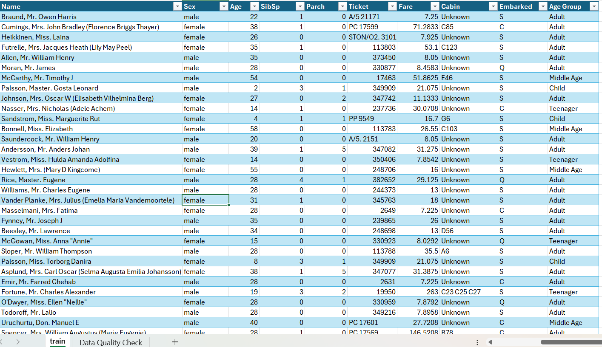

# SWYNEX Technologies – Final Data Analytics Project

## Overview

This repository contains my final Data Analytics project completed as part of my internship at **SWYNEX Technologies**.

The project covers the complete data analytics workflow using the **Titanic dataset**, from data cleaning and exploratory analysis to interactive dashboard creation.

## Tasks Completed

### Task 1 – Data Cleaning & Preparation

The Titanic dataset was cleaned and prepared using Microsoft Excel.

Activities included:
- Handling missing values
- Checking duplicate records
- Checking data consistency
- Validating numerical and categorical columns
- Preparing the cleaned dataset for analysis

**File:** `SWYNEX_Titanic_Data_Cleaning.xlsx`

### Task 2 – Exploratory Data Analysis

Exploratory Data Analysis was performed using Microsoft Excel.

Key analysis included:
- Total passengers
- Total survivors
- Survival rate
- Average age
- Average fare
- Survival by gender
- Survival by passenger class
- Passengers by embarkation port
- Passengers by age group
- Average fare by passenger class

**File:** `SWYNEX_Exploratory_Data_Analysis.xlsx`

### Task 3 – Interactive Dashboard

An interactive dashboard was created using **Microsoft Power BI**.

The dashboard includes:

#### KPIs
- Total Passengers: 891
- Total Survivors: 342
- Survival Rate: 38.38%
- Average Age: 29.39
- Average Fare: 32.20

#### Visualizations
- Survival Rate by Gender
- Survival Rate by Passenger Class
- Passengers by Embarked Port
- Passengers by Age Group
- Average Fare by Passenger Class

#### Interactive Filters
- Gender
- Passenger Class
- Embarked Port
- Age Group

**File:** `SWYNEX_Interactive_Dashboard.pbix`

## Key Findings

- The overall survival rate was approximately 38.38%.
- Female passengers had a higher survival rate than male passengers.
- First-class passengers had the highest average fare.
- Adults represented the largest age group in the dataset.
- Southampton was the most common embarkation port.

## Tools Used

- Microsoft Excel
- Microsoft Power BI
- GitHub

## Skills Demonstrated

- Data Cleaning
- Data Preparation
- Exploratory Data Analysis
- Data Visualization
- Dashboard Development
- Business Insights
- GitHub Project Management

## Internship

**Organization:** SWYNEX Technologies  
**Domain:** Data Analytics  
**Project:** Final Data Analytics Project

## Project Screenshots

### Data set

### Task 1 – Data Cleaning

### Task 2 – Exploratory Data Analysis

### Task 3 – Power BI Dashboard

